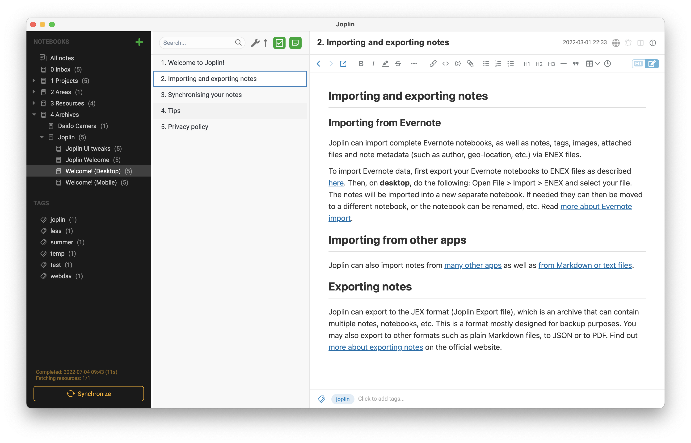

# EverJop — An Evernote-like Theme for Joplin

For those who want to use Joplin with Evernote's UI — not only the colors, but also the pixel-level details, which is more polished than Joplin's stock UI.

## Installation

1. Download `userstyle.css` & `userchrome.css`
2. Open Menu ➜ Preference ➜ Appereance ➜ Show Advanced Settings
3. Click "Custom stylesheet for rendered Markdown", and copy-paste the content of `userstyle.css` into it
4. Click "Custom stylesheet for Jopoin-wide app styles", and copy-paste the content of `userchrome.css` into it
5. Save the .css files and restart Joplin

## Features

- Mimics Evernote 10 UI as much as possible
- Some details tweaked for better-look (e.g. tag-bar colors)
- Optimized for speed as far as possible
- Tested on macOS

Not implemented:

- Preferences window not customized
- Not tested on Windows and Linux, yet
